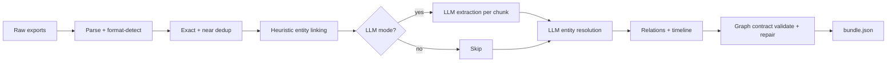

# EventGraph

A queryable knowledge graph of one real event — reconstructed from a noisy,
multi-format personal archive of email, WhatsApp, a calendar export, and PDFs.
Every fact is grounded back to the exact source message.

**Live:** [eventgraph.vercel.app](https://eventgraph.vercel.app) — the password is in the submission email.

---

## What it does

EventGraph turns a messy personal archive into a clean, navigable graph. The
hard problems it solves are not retrieval — they are:

- **Multi-source deduplication:** the same email exists as both a `.eml` file
  and inside a Gmail mbox; neither is double-counted.
- **Cross-source entity resolution:** one person shows up as four email
  addresses and three spellings of their name across email and WhatsApp;
  the system unifies them into one node with a merge audit trail.
- **Relevance scoping:** illness threads, group birthday chatter, unrelated
  work — all sit in the same archive. The pipeline marks what belongs to
  the event so queries aren't polluted.

Once built, the graph supports natural-language questions answered by graph
traversal, structured preset queries (money, who, timeline), and a full
corpus browser where every answer cites its source message.

---

## Pipeline



- **Extract model:** `claude-haiku-4-5` (batched, cached per content hash — same input → same output)
- **Resolve model:** `claude-sonnet-4-6` (per candidate block)
- **Query model:** `claude-sonnet-4-6` (BFS graph navigation → LLM answer)

---

## Local setup

```bash
# Backend (Python 3.11+)
python -m venv .venv && source .venv/bin/activate
pip install -r requirements.txt
cp .env.example .env          # edit LLM_API_KEY if you want LLM mode
make dev-backend              # http://localhost:8000

# Frontend (Node 18+)
cd frontend && npm install
npm run dev                   # http://localhost:3000
```

Local dev runs **without a password gate** when `SITE_PASSWORD` is unset in the frontend env.

```bash
make test                     # full test suite (124 tests)
```

---

## Rebuild from exports

```bash
# Dry-run: shows chunk count, cache hits, estimated cost
python -m scripts.build_graph --input $DATA_DIR/raw --out $DATA_DIR/bundle.json --dry-run

# Full build (only uncached chunks make real LLM calls)
python -m scripts.build_graph --input $DATA_DIR/raw --out $DATA_DIR/bundle.json --confirm
```

`--input` accepts either a directory of native exports (`.mbox`, `.eml`, `.txt`, `.csv`, `.pdf`)
or the legacy batch`*.md` format from `processed_data/`.

---

## Known limits

- JSON snapshot persistence (no database); the graph is rebuilt from scratch each run.
- 4 MB upload limit (Vercel request body cap).
- Near-duplicate recall degrades on aggressively reworded forwards.
- LLM extraction quality depends on chunk ordering; calendar rows parse poorly without context.
